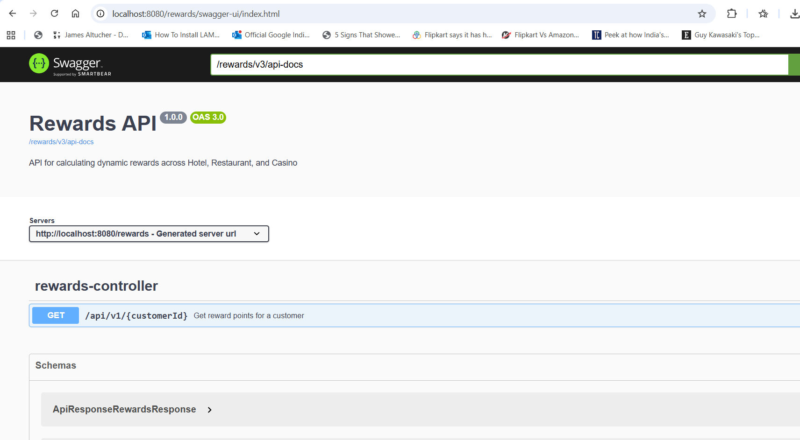
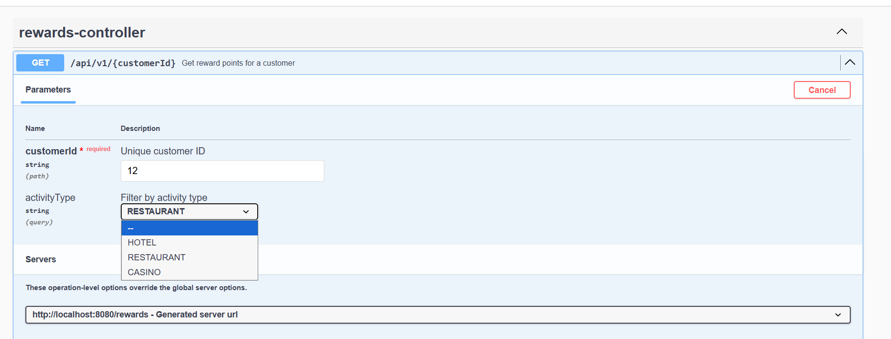
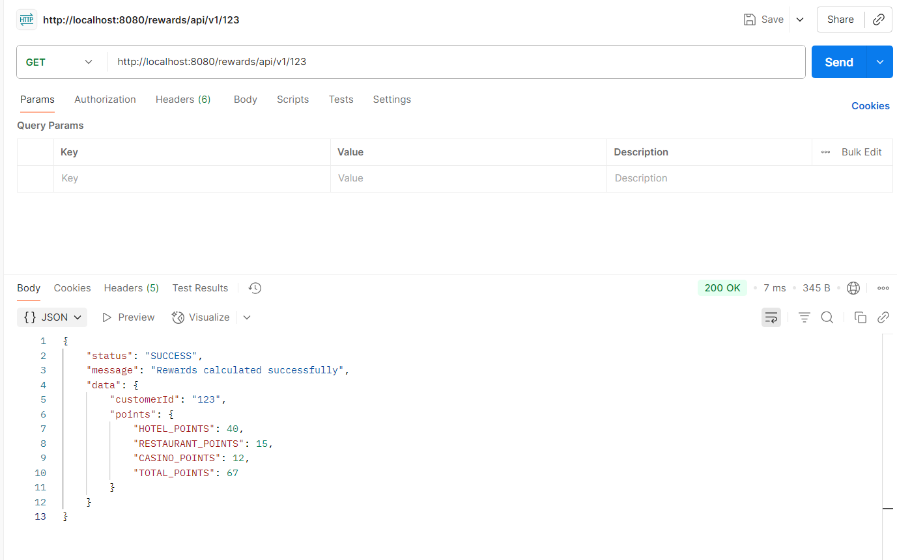
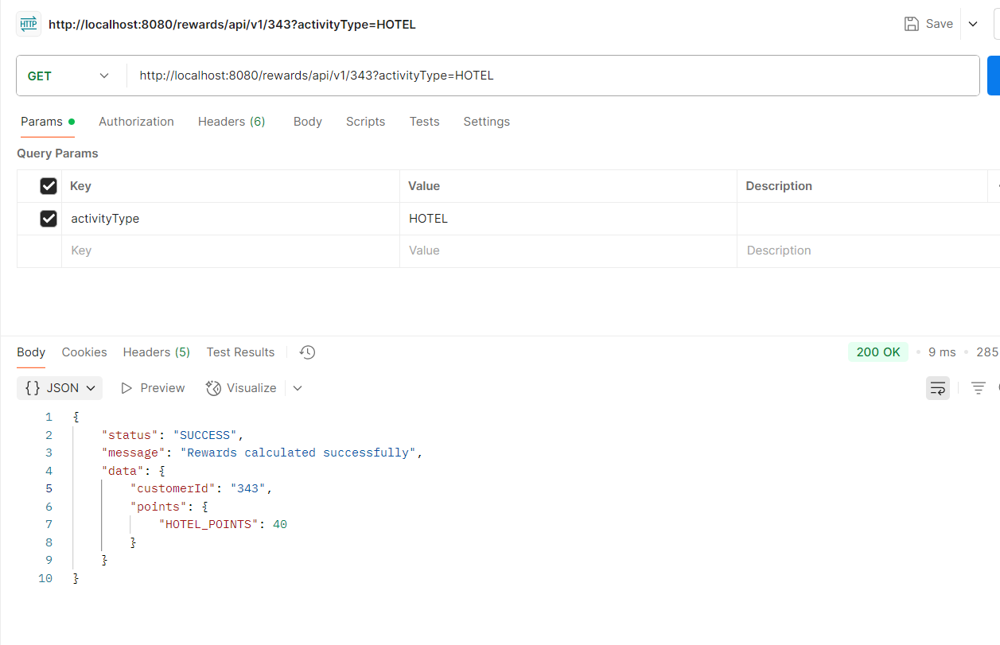
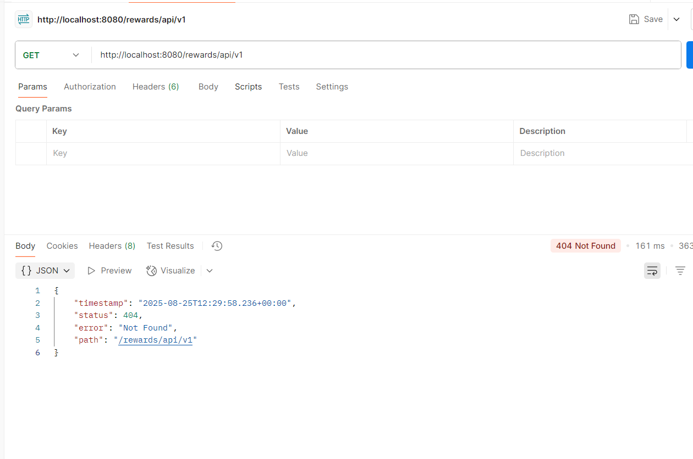
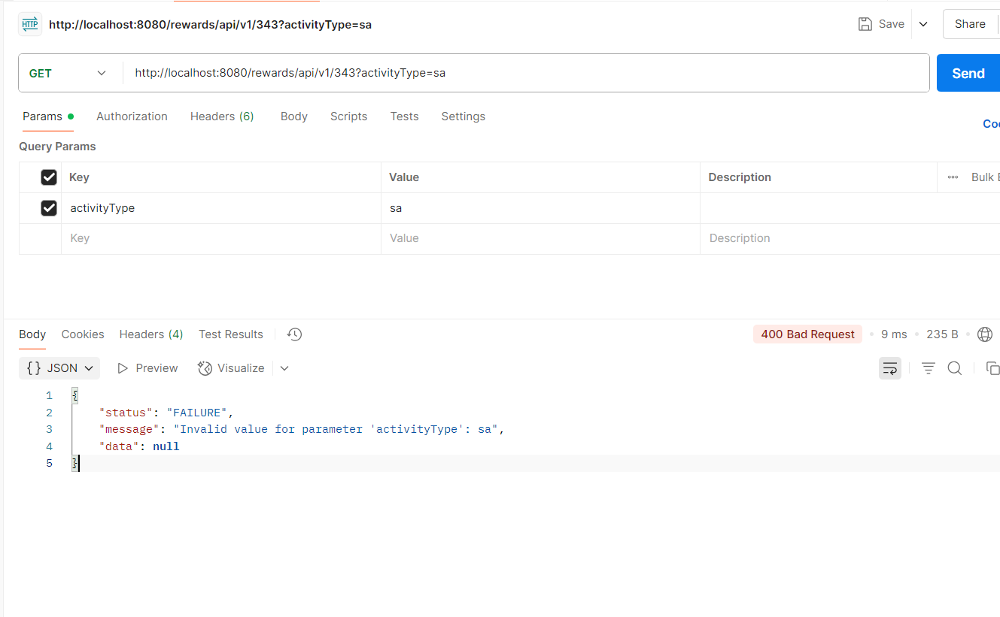

## Call Stack

This project follows below Spring Boot structure:

1. Controller Layer (REST APIs) - Handles HTTP requests and responses
2. Service Layer - Service layer had business logic and reward calculation rules
3. Client Layer - Client Communicates with external services Hotel/Restaurant/Casino systems
4. Repository Layer - Repository layer for database uses if needed
5. DTO/Model Layer - Data transfer between UI to BE and BE to UI

Flow: Controller → Service → Client/Repository → External System → Response

Swagger URL : http://localhost:8080/rewards/swagger-ui/index.html

Get Calculate Rewards API:
curl --location 'http://localhost:8080/rewards/api/v1/{customerId}?activityType={activityType}'
 - customerId - customer ID to calculate reward points
 - activityType - any of this HOTEL,RESTAURANT,CASINO enum value we have to pass to get rewards point for specific only otherwise it will return for all
 - Swagger Image for end Point: 
 - Get HTTP method

Below we have all response for this API for 200, 400 and 404 

It calculate rewards dynamically based on current data from Hotel, Restaurant and casino services (Mock Data) :
Empty Activity Type:200 (OK) 

Single Activity Type : 200 (OK)  (HOTEL,RESTAURANT,CASINO) 

Empty Customer Id: 404 - Not Found:

Invalid Activity Type: 400 Bad Request (HOTEL,RESTAURANT,CASINO)

