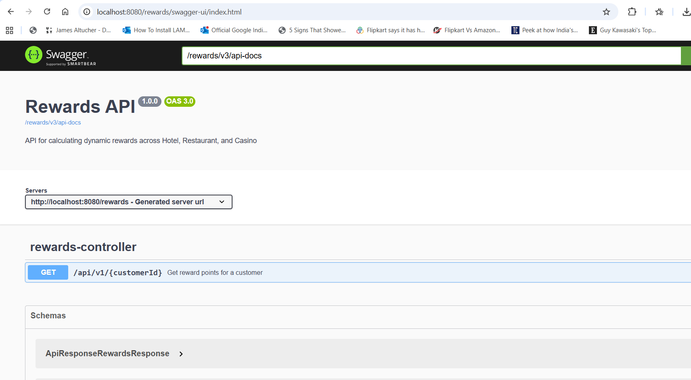
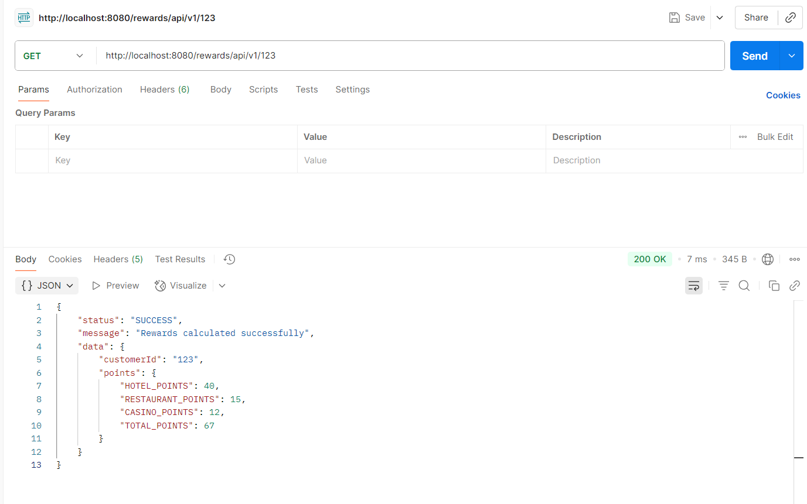
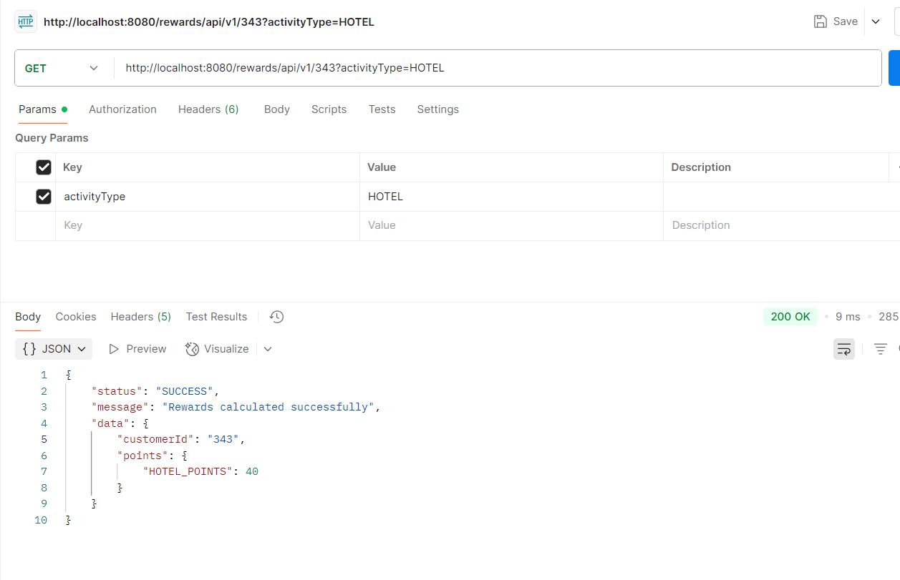
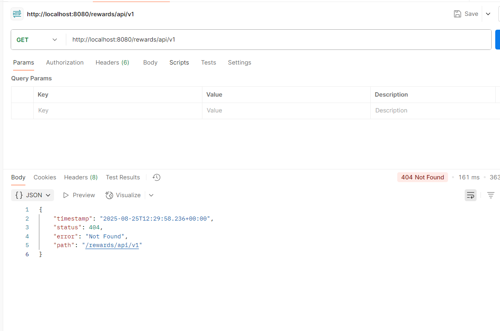
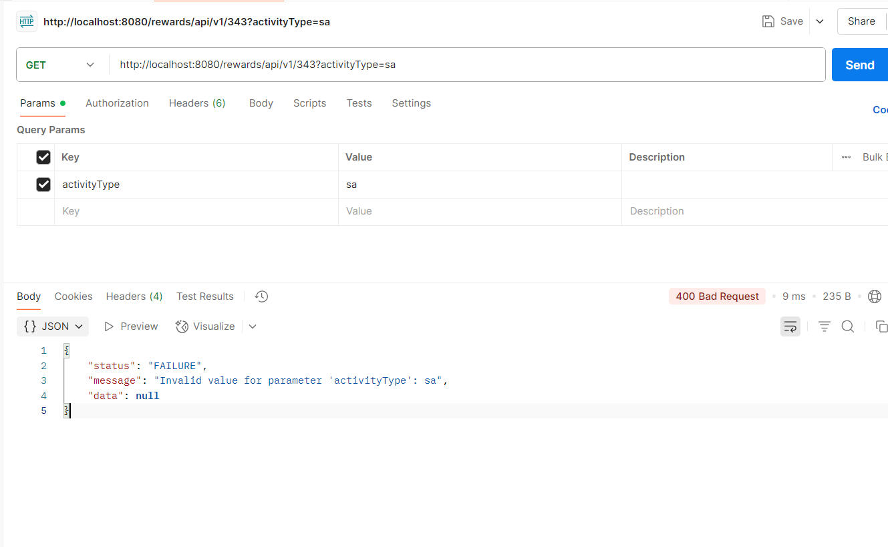

## Call Stack

This project follows below Spring Boot structure:

1. Controller Layer (REST APIs) - Handles HTTP requests and responses
2. Service Layer - Service layer had business logic and reward calculation rules
3. Client Layer - Client Communicates with external services Hotel/Restaurant/Casino systems
4. Repository Layer - Repository layer for database uses if needed
5. DTO/Model Layer - Data transfer between UI to BE and BE to UI

Flow: Controller → Service → Client/Repository → External System → Response

Swagger URL : http://localhost:8080/rewards/swagger-ui/index.html

Get Rewards API:
It calculate rewards dynamically based on current data (Mock Data) :
Empty Activity Type:200 (OK) 

Single Activity Type : 200 (OK)  (HOTEL,RESTAURANT,CASINO) 

Empty Customer Id: 404 - Not Found:

Invalid Activity Type: 400 Bad Request (HOTEL,RESTAURANT,CASINO)

